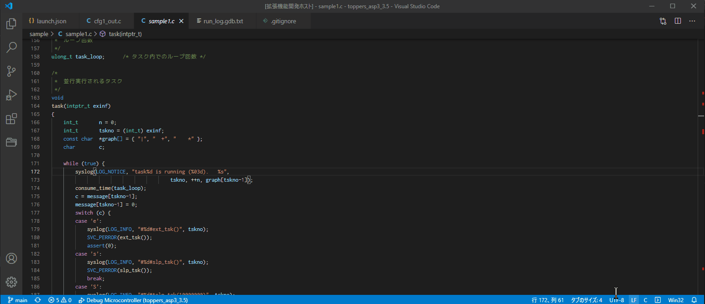

# file-open-history README
This extension outputs history of file opening actions in vscode"

# Setup
- Option1: get from Visual Studio Marketplace  
file-open-history - Visual Studio Marketplace  
https://marketplace.visualstudio.com/items?itemName=akiega.file-open-history  
- Option2: get from extension sidebar in vscode. please search "file-open-history"

# Usage
## Start (TextEditor case)
1. Open Command pallet
2. Type command `file-open-history: Start(TextEdirot)`
3. Done(will show text editor beside. You can see history of file opening)

## Start (Output channel)
1. Open Command pallet
2. Type command `file-open-history: Start(Output channel)`
3. Done(will show OUTPUT named "File Open History(file-open-history)". You can see history of file opening)

## End
1. Open Command pallet
2. type command `file-open-history: End`
3. Done(will hide OUTPUT named "File Open History(file-open-history)")

